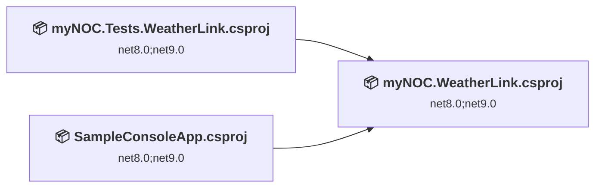
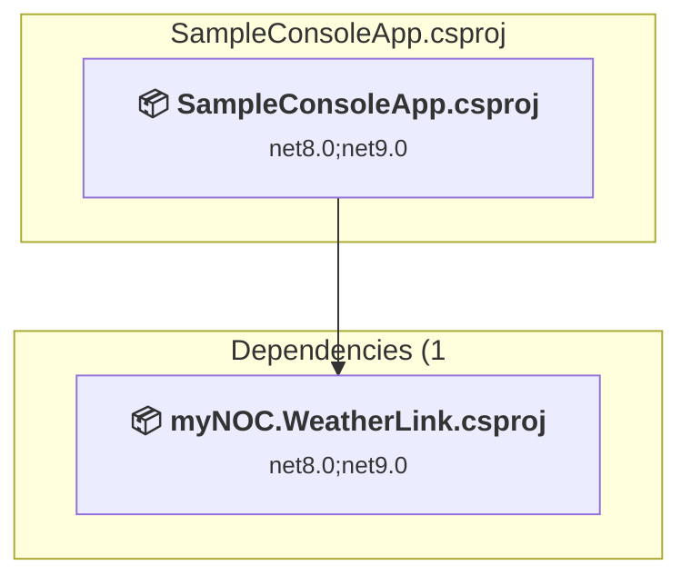
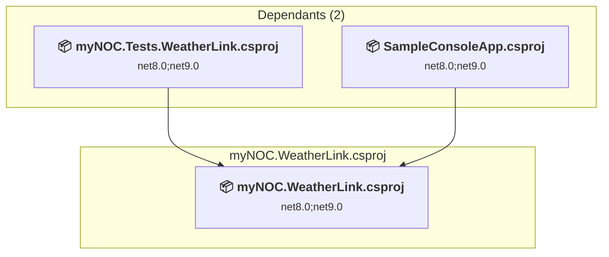
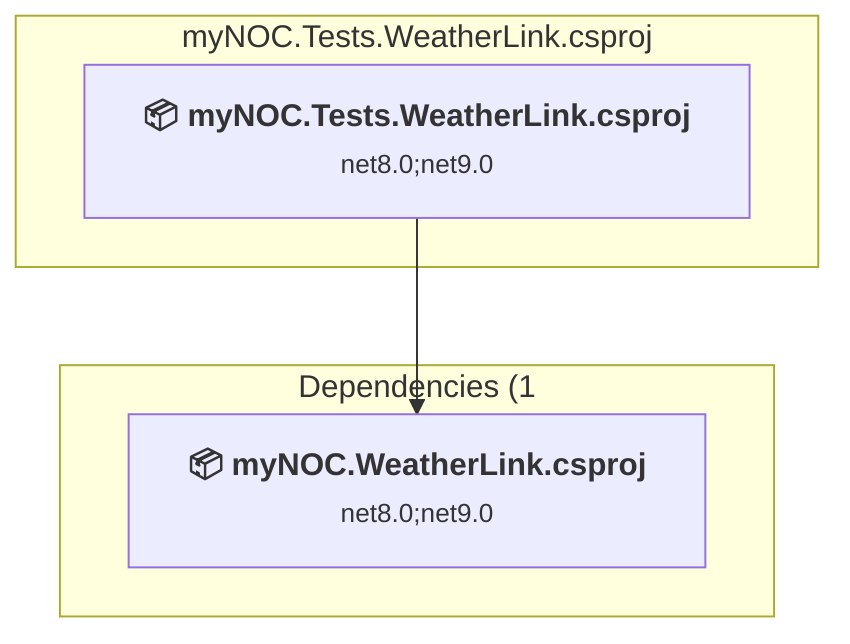

# Projects and dependencies analysis

This document provides a comprehensive overview of the projects and their dependencies in the context of upgrading to .NETCoreApp,Version=v10.0.

## Table of Contents

- [Executive Summary](#executive-Summary)
  - [Highlevel Metrics](#highlevel-metrics)
  - [Projects Compatibility](#projects-compatibility)
  - [Package Compatibility](#package-compatibility)
  - [API Compatibility](#api-compatibility)
  - [Binding Redirect Configuration](#binding-redirect-configuration)
- [Aggregate NuGet packages details](#aggregate-nuget-packages-details)
- [Top API Migration Challenges](#top-api-migration-challenges)
  - [Technologies and Features](#technologies-and-features)
  - [Most Frequent API Issues](#most-frequent-api-issues)
- [Projects Relationship Graph](#projects-relationship-graph)
- [Project Details](#project-details)

  - [samples\SampleConsoleApp\SampleConsoleApp.csproj](#samplessampleconsoleappsampleconsoleappcsproj)
  - [src\myNOC.WeatherLink\myNOC.WeatherLink.csproj](#srcmynocweatherlinkmynocweatherlinkcsproj)
  - [tests\myNOC.Tests.WeatherLink\myNOC.Tests.WeatherLink.csproj](#testsmynoctestsweatherlinkmynoctestsweatherlinkcsproj)

## Executive Summary

### Highlevel Metrics

| Metric | Count | Status |
| :--- | :---: | :--- |
| Total Projects | 3 | All require upgrade |
| Total NuGet Packages | 13 | 8 need upgrade |
| Total Code Files | 49 |  |
| Total Code Files with Incidents | 9 |  |
| Total Lines of Code | 2138 |  |
| Total Number of Issues | 33 |  |
| Estimated LOC to modify | 21+ | at least 1.0% of codebase |

### Projects Compatibility

| Project | Target Framework | Difficulty | Package Issues | API Issues | Binding Issues | Est. LOC Impact | Description |
| :--- | :---: | :---: | :---: | :---: | :---: | :---: | :--- |
| [samples\SampleConsoleApp\SampleConsoleApp.csproj](#samplessampleconsoleappsampleconsoleappcsproj) | net8.0;net9.0 | 🟢 Low | 2 | 3 | 0 | 3+ | DotNetCoreApp, Sdk Style = True |
| [src\myNOC.WeatherLink\myNOC.WeatherLink.csproj](#srcmynocweatherlinkmynocweatherlinkcsproj) | net8.0;net9.0 | 🟢 Low | 4 | 10 | 0 | 10+ | ClassLibrary, Sdk Style = True |
| [tests\myNOC.Tests.WeatherLink\myNOC.Tests.WeatherLink.csproj](#testsmynoctestsweatherlinkmynoctestsweatherlinkcsproj) | net8.0;net9.0 | 🟢 Low | 3 | 8 | 0 | 8+ | DotNetCoreApp, Sdk Style = True |

### Package Compatibility

| Status | Count | Percentage |
| :--- | :---: | :---: |
| ✅ Compatible | 5 | 38.5% |
| ⚠️ Incompatible | 0 | 0.0% |
| 🔄 Upgrade Recommended | 8 | 61.5% |
| ***Total NuGet Packages*** | ***13*** | ***100%*** |

### API Compatibility

| Category | Count | Impact |
| :--- | :---: | :--- |
| 🔴 Binary Incompatible | 2 | High - Require code changes |
| 🟡 Source Incompatible | 0 | Medium - Needs re-compilation and potential conflicting API error fixing |
| 🔵 Behavioral change | 19 | Low - Behavioral changes that may require testing at runtime |
| ✅ Compatible | 3114 |  |
| ***Total APIs Analyzed*** | ***3135*** |  |

## Aggregate NuGet packages details

| Package | Current Version | Suggested Version | Projects | Description |
| :--- | :---: | :---: | :--- | :--- |
| coverlet.collector | 6.0.3 |  | [myNOC.Tests.WeatherLink.csproj](#testsmynoctestsweatherlinkmynoctestsweatherlinkcsproj) | ✅Compatible |
| Microsoft.Extensions.Configuration.EnvironmentVariables | 9.0.0 | 10.0.9 | [SampleConsoleApp.csproj](#samplessampleconsoleappsampleconsoleappcsproj) | NuGet package upgrade is recommended |
| Microsoft.Extensions.DependencyInjection | 9.0.0 | 10.0.9 | [myNOC.Tests.WeatherLink.csproj](#testsmynoctestsweatherlinkmynoctestsweatherlinkcsproj) | NuGet package upgrade is recommended |
| Microsoft.Extensions.DependencyInjection.Abstractions | 9.0.0 | 10.0.9 | [myNOC.WeatherLink.csproj](#srcmynocweatherlinkmynocweatherlinkcsproj) | NuGet package upgrade is recommended |
| Microsoft.Extensions.Http | 9.0.0 | 10.0.9 | [myNOC.WeatherLink.csproj](#srcmynocweatherlinkmynocweatherlinkcsproj) | NuGet package upgrade is recommended |
| Microsoft.Extensions.Logging | 9.0.0 | 10.0.9 | [myNOC.Tests.WeatherLink.csproj](#testsmynoctestsweatherlinkmynoctestsweatherlinkcsproj) | NuGet package upgrade is recommended |
| Microsoft.Extensions.Logging.Abstractions | 9.0.0 | 10.0.9 | [myNOC.WeatherLink.csproj](#srcmynocweatherlinkmynocweatherlinkcsproj) | NuGet package upgrade is recommended |
| Microsoft.Extensions.Logging.Console | 9.0.0 | 10.0.9 | [myNOC.Tests.WeatherLink.csproj](#testsmynoctestsweatherlinkmynoctestsweatherlinkcsproj) [SampleConsoleApp.csproj](#samplessampleconsoleappsampleconsoleappcsproj) | NuGet package upgrade is recommended |
| Microsoft.NET.Test.Sdk | 17.12.0 |  | [myNOC.Tests.WeatherLink.csproj](#testsmynoctestsweatherlinkmynoctestsweatherlinkcsproj) | ✅Compatible |
| MSTest.TestAdapter | 3.7.0 |  | [myNOC.Tests.WeatherLink.csproj](#testsmynoctestsweatherlinkmynoctestsweatherlinkcsproj) | ✅Compatible |
| MSTest.TestFramework | 3.7.0 |  | [myNOC.Tests.WeatherLink.csproj](#testsmynoctestsweatherlinkmynoctestsweatherlinkcsproj) | ✅Compatible |
| NSubstitute | 5.3.0 |  | [myNOC.Tests.WeatherLink.csproj](#testsmynoctestsweatherlinkmynoctestsweatherlinkcsproj) | ✅Compatible |
| System.Text.Json | 9.0.0 | 10.0.9 | [myNOC.WeatherLink.csproj](#srcmynocweatherlinkmynocweatherlinkcsproj) | NuGet package upgrade is recommended |

## Top API Migration Challenges

### Technologies and Features

| Technology | Issues | Percentage | Migration Path |
| :--- | :---: | :---: | :--- |

### Most Frequent API Issues

| API | Count | Percentage | Category |
| :--- | :---: | :---: | :--- |
| T:System.Uri | 7 | 33.3% | Behavioral Change |
| T:System.Net.Http.HttpContent | 5 | 23.8% | Behavioral Change |
| M:Microsoft.Extensions.Logging.ConsoleLoggerExtensions.AddConsole(Microsoft.Extensions.Logging.ILoggingBuilder) | 2 | 9.5% | Behavioral Change |
| M:System.Uri.#ctor(System.String) | 2 | 9.5% | Behavioral Change |
| M:Microsoft.Extensions.Configuration.ConfigurationBinder.GetValue''1(Microsoft.Extensions.Configuration.IConfiguration,System.String) | 2 | 9.5% | Binary Incompatible |
| M:System.Uri.#ctor(System.Uri,System.String) | 1 | 4.8% | Behavioral Change |
| P:System.Uri.AbsolutePath | 1 | 4.8% | Behavioral Change |
| M:Microsoft.Extensions.DependencyInjection.HttpClientFactoryServiceCollectionExtensions.AddHttpClient(Microsoft.Extensions.DependencyInjection.IServiceCollection) | 1 | 4.8% | Behavioral Change |

## Projects Relationship Graph

Legend:
📦 SDK-style project
⚙️ Classic project

## Project Details

### samples\SampleConsoleApp\SampleConsoleApp.csproj

#### Project Info

- **Current Target Framework:** net8.0;net9.0
- **Proposed Target Framework:** net8.0;net9.0;net10.0
- **SDK-style**: True
- **Project Kind:** DotNetCoreApp
- **Dependencies**: 1
- **Dependants**: 0
- **Number of Files**: 1
- **Number of Files with Incidents**: 2
- **Lines of Code**: 45
- **Estimated LOC to modify**: 3+ (at least 6.7% of the project)

#### Dependency Graph

Legend:
📦 SDK-style project
⚙️ Classic project

### API Compatibility

| Category | Count | Impact |
| :--- | :---: | :--- |
| 🔴 Binary Incompatible | 2 | High - Require code changes |
| 🟡 Source Incompatible | 0 | Medium - Needs re-compilation and potential conflicting API error fixing |
| 🔵 Behavioral change | 1 | Low - Behavioral changes that may require testing at runtime |
| ✅ Compatible | 68 |  |
| ***Total APIs Analyzed*** | ***71*** |  |

### src\myNOC.WeatherLink\myNOC.WeatherLink.csproj

#### Project Info

- **Current Target Framework:** net8.0;net9.0
- **Proposed Target Framework:** net8.0;net9.0;net10.0
- **SDK-style**: True
- **Project Kind:** ClassLibrary
- **Dependencies**: 0
- **Dependants**: 2
- **Number of Files**: 39
- **Number of Files with Incidents**: 4
- **Lines of Code**: 1367
- **Estimated LOC to modify**: 10+ (at least 0.7% of the project)

#### Dependency Graph

Legend:
📦 SDK-style project
⚙️ Classic project

### API Compatibility

| Category | Count | Impact |
| :--- | :---: | :--- |
| 🔴 Binary Incompatible | 0 | High - Require code changes |
| 🟡 Source Incompatible | 0 | Medium - Needs re-compilation and potential conflicting API error fixing |
| 🔵 Behavioral change | 10 | Low - Behavioral changes that may require testing at runtime |
| ✅ Compatible | 2127 |  |
| ***Total APIs Analyzed*** | ***2137*** |  |

### tests\myNOC.Tests.WeatherLink\myNOC.Tests.WeatherLink.csproj

#### Project Info

- **Current Target Framework:** net8.0;net9.0
- **Proposed Target Framework:** net8.0;net9.0;net10.0
- **SDK-style**: True
- **Project Kind:** DotNetCoreApp
- **Dependencies**: 1
- **Dependants**: 0
- **Number of Files**: 12
- **Number of Files with Incidents**: 3
- **Lines of Code**: 726
- **Estimated LOC to modify**: 8+ (at least 1.1% of the project)

#### Dependency Graph

Legend:
📦 SDK-style project
⚙️ Classic project

### API Compatibility

| Category | Count | Impact |
| :--- | :---: | :--- |
| 🔴 Binary Incompatible | 0 | High - Require code changes |
| 🟡 Source Incompatible | 0 | Medium - Needs re-compilation and potential conflicting API error fixing |
| 🔵 Behavioral change | 8 | Low - Behavioral changes that may require testing at runtime |
| ✅ Compatible | 919 |  |
| ***Total APIs Analyzed*** | ***927*** |  |

